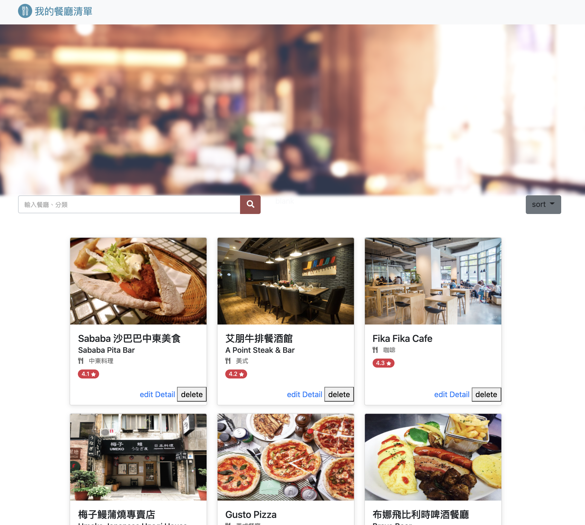
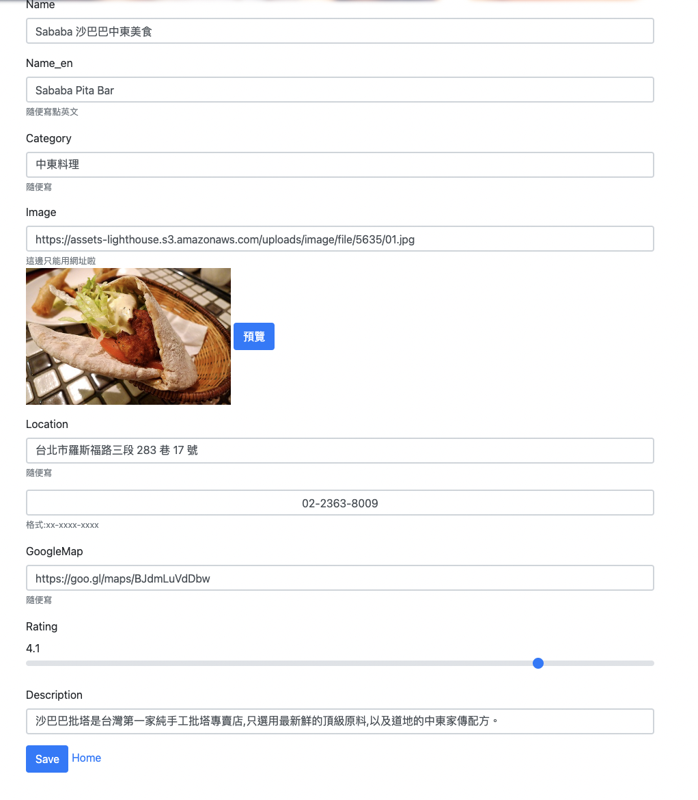

# ac_restaurant_list
使用者登錄後可以紀錄餐廳資料的網頁。


### Function list
- 使用者可以用email建立帳號
- 使用者可以用Facebook帳號直接登陸
- 


### Installing

需要下列環境
```
"node.js"
"express": "^4.17.2",
"express-handlebars": "^6.0.2"
"mongoose": "^5.9.7"
MongoDB
```
開啟終端機(Terminal)，cd到存放專案本機位置並執行
```
git clone https://github.com/eruc1117/ac_restaurant_list_V1.1.git
```
下載專案後再次cd到ac_restaurant_list，再往下進行<br>
express 安裝步驟
```
npm init -y
npm i express
```
安裝 express handlebars
```
npm i express-handlebars@6.0.2 
```
確認與MongoDB連線

安裝 Mongoose
```
npm install mongoose
```

製作種子資料
```
npm run seed
```

執行
```
nodemon app.js
```
將terminal顯示的localhost:3000貼到網頁上執行

## Running the tests
顯示全數餐廳，以id進行升序排列，最一開始所進入的頁面


以資料中name進行升序排列


以資料中name進行降序排列


以資料中category進行升序排列


以資料中location進行升序排列


顯示餐廳詳細資料


顯示edit頁面

在頁面中增加預覽圖片功能，使用者可以先檢查輸入是否正確，修改資料時透過簡化輸入方式，讓使用者直接選取rating分數，減少使用者輸入，
電話號碼搭配正規表達式檢查使用者輸入格式，其餘保持基礎限制不能提交空白資料


