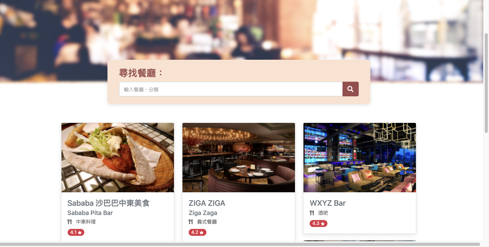
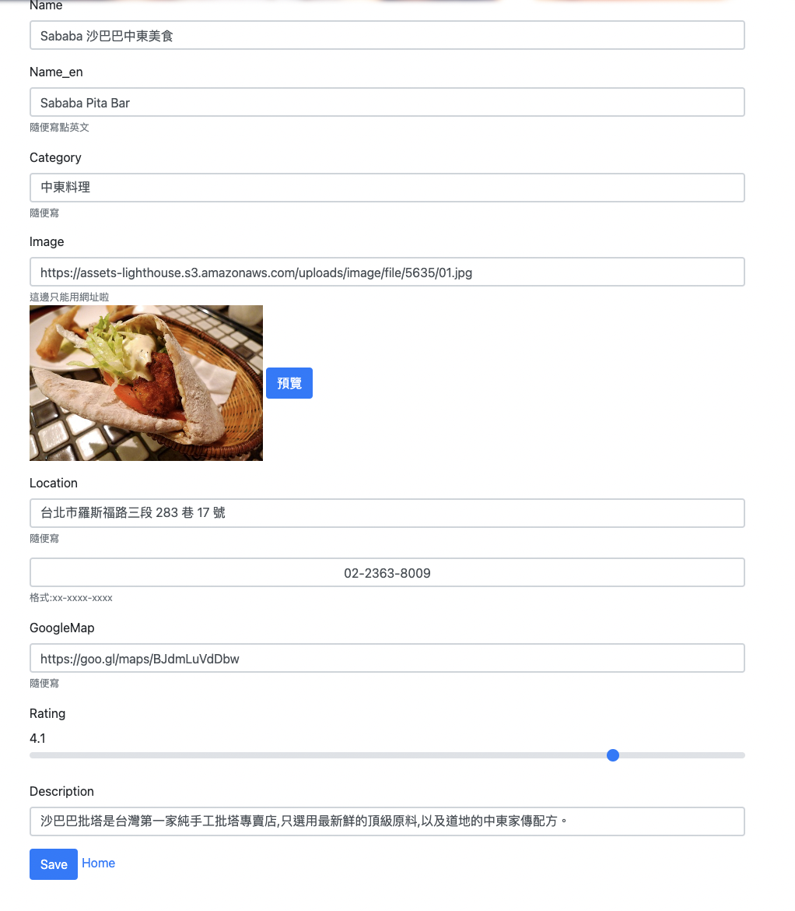
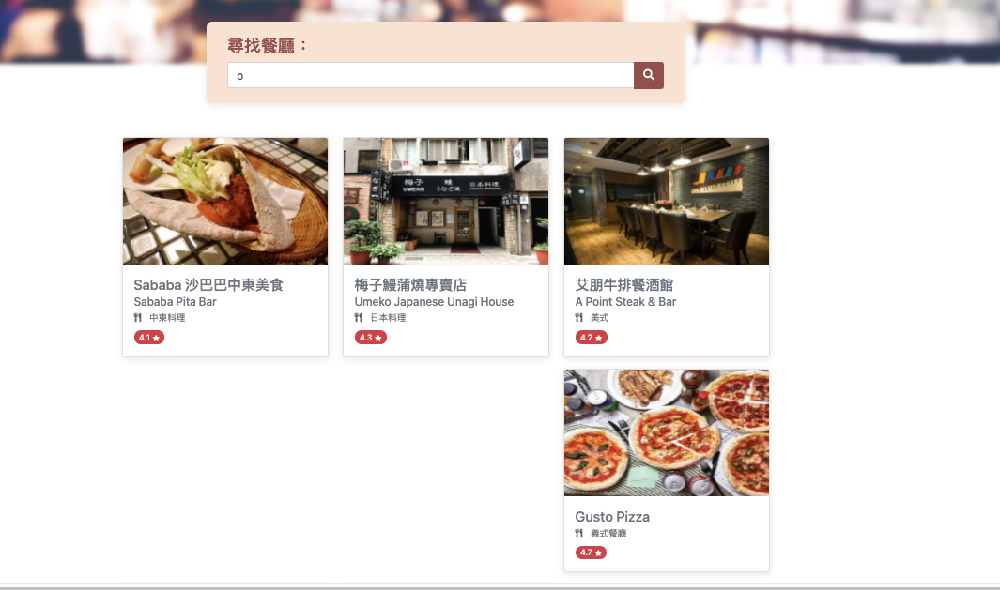

# ac_restaurant_list
顯示全部餐廳(簡單資料)，或是點擊後顯示詳細資料，能夠修改或刪除餐廳資料


### Function list

- 能以中英文的店名或餐廳種類進行搜尋
- 點擊餐廳圖片或detail顯示詳細資料
- 在詳細資料頁面可以透過下方Home按鈕回到首頁
- 透過edit連結進入餐廳修改頁面
- 在餐廳修改頁面可以預覽圖片，rating隨著調整變化
- 點擊delete刪除餐廳
- 點擊左上角我的餐廳清單回到初始頁面(顯示全部餐廳)

### Installing

需要下列環境
```
"node.js"
"express": "^4.17.2",
"express-handlebars": "^6.0.2"
"mongoose": "^5.9.7"
MongoDB
```
開啟終端機(Terminal)，cd到存放專案本機位置並執行
```
git clone https://github.com/eruc1117/ac_restaurant_list_V1.1.git
```
下載專案後再次cd到ac_restaurant_list，再往下進行<br>
express 安裝步驟
```
npm init -y
npm i express
```
安裝 express handlebars
```
npm i express-handlebars@6.0.2 
```
確認與MongoDB連線

安裝 Mongoose
```
npm install mongoose
```

製作種子資料
```
npm run seed
```

執行
```
nodemon app.js
```
將terminal顯示的localhost:3000貼到網頁上執行

## Running the tests
顯示全數餐廳(或是搜尋結果)

顯示餐廳詳細資料

顯示edit頁面


## 顯示方式不合預期

直覺是從左到右，看起來似乎是右到左

